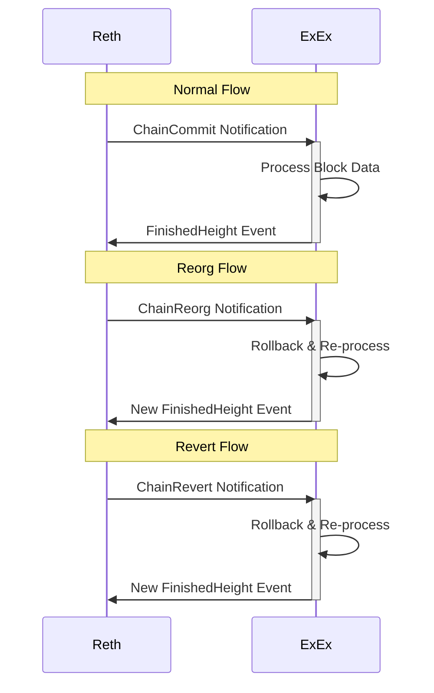

ExExes are [Futures](https://doc.rust-lang.org/std/future/trait.Future.html) that run indefinitely alongside Reth — as simple as that.

An ExEx is usually driven by and acts on new notifications about chain commits, reverts, and reorgs, but it can span beyond that. They are installed into the node using the [node builder](https://reth.rs/docs/reth/builder/struct.NodeBuilder.html). Reth manages the full lifecycle of all registered ExExes.

## Lifecycle

Reth is responsible for:

- Polling ExEx futures
- Sending notifications about new chain commits, reverts, and reorgs from both historical and live sync
- Processing events emitted by ExExes
- Pruning data that has been acknowledged by all ExExes
- Shutting ExExes down when the node shuts down

## Notification flow



## ExExNotification

Every notification delivered to an ExEx is one of three variants:

| Variant | Description |
| --- | --- |
| `ChainCommitted { new }` | A new chain of blocks was committed. `new` is the canonical chain tip. |
| `ChainReorged { old, new }` | The canonical chain was reorganized. `old` is the reverted chain, `new` is the new canonical chain. |
| `ChainReverted { old }` | A previously committed chain was reverted. `old` is what was rolled back. |

Notifications carry an `Arc<Chain>` that holds the full block and receipt data for the affected range. You can call `notification.committed_chain()` and `notification.reverted_chain()` as convenience helpers — both return `Option<Arc<Chain>>`, which lets you handle all three variants with the same two checks:

```rust
if let Some(reverted_chain) = notification.reverted_chain() {
    // undo state for reverted_chain
}

if let Some(committed_chain) = notification.committed_chain() {
    // apply state for committed_chain
}
```

## ExExContext

When an ExEx is initialized, it receives an `ExExContext` that provides access to node state and the communication channels:

```rust
pub struct ExExContext<Node: FullNodeComponents> {
    /// The current head of the blockchain at launch.
    pub head: BlockNumHash,
    /// The config of the node.
    pub config: NodeConfig<<Node::Types as NodeTypes>::ChainSpec>,
    /// The loaded node config.
    pub reth_config: reth_config::Config,
    /// Channel used to send ExExEvents to the rest of the node.
    pub events: UnboundedSender<ExExEvent>,
    /// Channel to receive ExExNotifications.
    pub notifications: ExExNotifications<Node::Provider, Node::Evm>,
    /// All node components (pool, network, provider, evm config, etc.)
    pub components: Node,
}
```

Key fields:

- **`notifications`** — an async stream of `ExExNotification`. Await values with `ctx.notifications.try_next().await?`.
- **`events`** — an unbounded sender used to emit `ExExEvent`s back to the node.
- **`components`** — access to the pool, network, provider, EVM config, payload builder, and task executor.

Helper methods on `ExExContext` include `ctx.pool()`, `ctx.provider()`, `ctx.network()`, `ctx.task_executor()`, and `ctx.send_finished_height(block)`.

## ExExEvent and FinishedHeight

The only event ExExes currently send back to the node is `ExExEvent::FinishedHeight`:

```rust
pub enum ExExEvent {
    /// Highest block processed by the ExEx.
    ///
    /// The ExEx must guarantee that it will not require all earlier blocks in the future,
    /// meaning that Reth is allowed to prune them.
    ///
    /// On reorgs, it's possible for the height to go down.
    FinishedHeight(BlockNumHash),
}
```

Send it after processing each committed chain tip:

```rust
ctx.events.send(ExExEvent::FinishedHeight(committed_chain.tip().num_hash()))?;
```

## Pruning

Pruning deserves a special mention.

ExExes **should** emit `ExExEvent::FinishedHeight` to signify what blocks have been processed. This is the signal Reth uses to determine what historical state is safe to prune on a full or pruned node.

<Warning>
An ExEx will only receive notifications for block numbers **greater than** the block in the most recently emitted `FinishedHeight` event.

For example: if an ExEx emits `FinishedHeight` for block `#100`, it will only receive future notifications for `block_number > 100`. Never emit a height you have not actually finished processing.
</Warning>

On reorgs, the `FinishedHeight` may go down — that is expected. The node tracks the minimum across all registered ExExes and prunes only data that every ExEx has acknowledged.

## Backfill

When an ExEx starts with a recorded head (via `ctx.notifications.set_with_head(exex_head)`), the notification stream automatically backfills missing blocks from the canonical database before delivering live notifications. This means your ExEx can restart from a checkpoint without receiving duplicate notifications for blocks it already processed.

During backfill the stream runs a `BackfillJob` and delivers `ChainCommitted` notifications for each historical range. Once the backfill is complete, the stream transitions to delivering live notifications from the node as normal.
