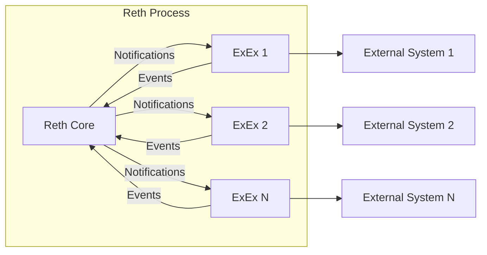

Execution Extensions (ExExes) allow developers to build their own infrastructure that relies on Reth as a base for driving the chain forward.

An Execution Extension is a task that derives its state from changes in Reth's state. Some examples of such state derivations are rollups, bridges, and indexers.

They are called Execution Extensions because the main trigger for them is the execution of new blocks (or reorgs of old blocks) initiated by Reth.

## What ExExes are

An ExEx is a Rust [`Future`](https://doc.rust-lang.org/std/future/trait.Future.html) that runs indefinitely alongside the Reth node process. It receives notifications whenever blocks are committed, reverted, or reorganized, and can send events back to the node to signal what has been processed.

<CardGroup cols={2}>
  <Card title="Indexers" icon="database">
    Index on-chain data into a custom database as blocks are committed.
  </Card>
  <Card title="Bridges" icon="arrow-right-left">
    React to deposits and withdrawals on chain to trigger cross-chain operations.
  </Card>
  <Card title="Rollups" icon="layers">
    Derive rollup state from L1 block execution and state transitions.
  </Card>
  <Card title="MEV & Analytics" icon="chart-line">
    Analyze transaction ordering, simulate bundles, or produce real-time metrics.
  </Card>
</CardGroup>

## Architecture

ExExes run inside the same process as Reth. Each ExEx receives a stream of `ExExNotification`s from the node and sends `ExExEvent`s back. Multiple ExExes can run simultaneously, each receiving the same notifications independently.

## What ExExes are not

Execution Extensions are **not** separate processes that connect to the main Reth node process over a network socket. Instead, ExExes are compiled into the same binary as Reth and run alongside it, using shared memory for communication.

<Note>
If you want to build an Execution Extension that forwards data to a separate process, see the [Remote ExEx](/exex/remote) guide.
</Note>

## How to build an ExEx

The guides below walk through building an ExEx from scratch, adding state tracking, and optionally forwarding data to an external process.

<Steps>
  <Step title="Understand the notification system">
    Learn how ExExes receive chain events and communicate back to the node.

    [How ExExes work](/exex/how-it-works)
  </Step>
  <Step title="Write your first ExEx">
    Build a minimal ExEx that logs block information using `install_exex()`.

    [Hello World](/exex/hello-world)
  </Step>
  <Step title="Track state across blocks">
    Convert your ExEx to a struct that implements `Future` so you can accumulate state and handle reorgs.

    [Tracking State](/exex/tracking-state)
  </Step>
  <Step title="Forward to an external process (optional)">
    Stream notifications to a separate process over gRPC using Tonic.

    [Remote ExEx](/exex/remote)
  </Step>
</Steps>

<Tip>
For more practical examples and ready-to-use ExEx implementations, see the [reth-exex-examples](https://github.com/paradigmxyz/reth-exex-examples) repository, which contains indexers, bridges, and other state derivation patterns.
</Tip>
