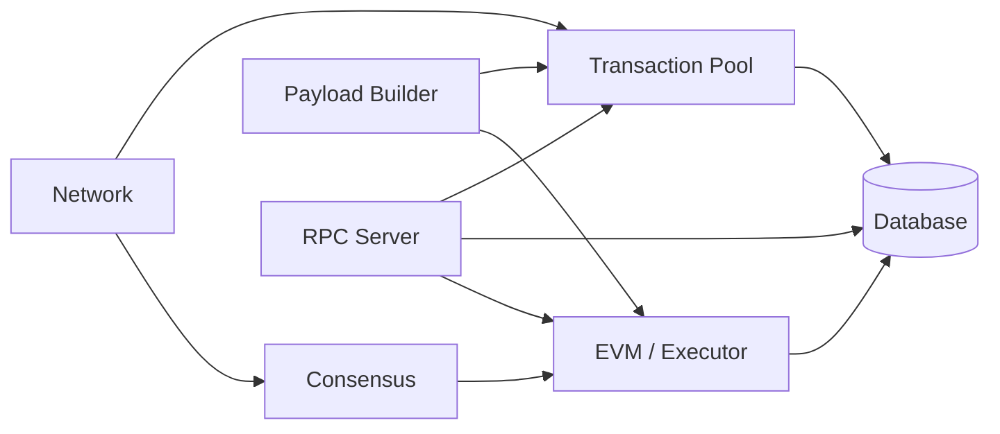

A Reth node is assembled from a set of well-defined, independently replaceable components. Each component is a trait with a default Ethereum implementation. You can keep all defaults and only replace the one you care about — the type system enforces that your custom component is compatible with the rest.

## Component overview



| Component | Trait | Default implementation |
|---|---|---|
| Transaction Pool | `PoolBuilder` | `EthTransactionPool` |
| Network | `NetworkBuilder` | `EthNetworkManager` |
| EVM / Executor | `ExecutorBuilder` | `EthEvmConfig` |
| Consensus | `ConsensusBuilder` | `EthBeaconConsensus` |
| Payload Builder | `PayloadServiceBuilder` | `EthereumPayloadBuilder` |

## Network

The network component handles all P2P communication. It discovers peers using discv4/discv5, manages active connections, and runs the ETH wire protocol for block and transaction propagation.

Responsibilities:
- Peer discovery and connection management
- Transaction gossip (broadcasting new transactions to peers)
- Block header and body downloads during sync
- ETH protocol message handling (eth/68, eth/69)

Customize with `NetworkBuilder`. Your builder receives a `BuilderContext` (with access to node config and the task executor) and a handle to the transaction pool.

## Transaction pool

The transaction pool stores pending transactions before they are included in blocks. It validates incoming transactions against the current chain state, maintains priority ordering, and handles replacement logic (gas price bumping).

Responsibilities:
- Transaction signature and nonce validation
- Gas price ordering (EIP-1559 priority fees)
- Blob transaction and sidecar management (EIP-4844)
- Pool eviction when size limits are exceeded
- Local transaction backup and restore

Customize with `PoolBuilder`. Your implementation of `build_pool` receives the `BuilderContext` and the EVM config (used to configure the transaction validator).

## Consensus

The consensus component validates blocks according to the Ethereum protocol rules. In a post-Merge node, this is split: the consensus layer (a separate beacon client) drives fork choice, while the Reth consensus component validates the execution payload.

Responsibilities:
- Block header validation (gas limit, base fee, timestamp)
- Block body validation (transaction root, withdrawals root)
- Pre-Merge total difficulty checks

Customize with `ConsensusBuilder`. This is the right place to add chain-specific validation rules, such as those needed for a custom L2.

## EVM and executor

The EVM component configures how transactions are executed and how blocks are built. It wraps [revm](https://github.com/bluealloy/revm) and adds Reth-specific context: the chain spec, the current hardfork schedule, and receipt building.

Responsibilities:
- EVM environment setup (chainspec, hardfork activation)
- Block execution (running all transactions, accumulating receipts)
- State root calculation
- Payload building (assembling new blocks for the consensus layer)
- Custom precompiles

Customize with `ExecutorBuilder`. This is also where you install custom precompiles or hook into the transaction execution loop.

## RPC server

The RPC component runs the JSON-RPC server that external clients connect to. It exposes all standard Ethereum namespaces (`eth_`, `debug_`, `trace_`, `txpool_`) plus Engine API endpoints for the consensus client.

Responsibilities:
- Standard `eth_*` methods (send transactions, query state, get blocks)
- `debug_*` and `trace_*` for transaction tracing
- WebSocket subscriptions (`eth_subscribe`)
- Engine API (`engine_newPayloadV3`, `engine_forkchoiceUpdatedV3`)
- Custom RPC namespace extension

<Note>
The RPC component is configured through `EthereumAddOns`, not through the `ComponentsBuilder`. Use `with_add_ons` on the node builder to customize RPC behavior.
</Note>

## Customizing components

All components except RPC are configured through `ComponentsBuilder`, which is returned by `EthereumNode::components()`. Each method on the builder accepts a custom builder for that slot:

```rust
use reth_ethereum::{
    cli::interface::Cli,
    node::{node::EthereumAddOns, EthereumNode},
};

fn main() {
    Cli::parse_args()
        .run(async move |builder, _| {
            let handle = builder
                .with_types::<EthereumNode>()
                .with_components(
                    EthereumNode::components()
                        // Replace the transaction pool
                        .pool(CustomPoolBuilder::default())
                        // Replace the network
                        // .network(CustomNetworkBuilder::default())
                        // Replace the EVM / executor
                        // .executor(CustomExecutorBuilder::default())
                        // Replace the consensus engine
                        // .consensus(CustomConsensusBuilder::default())
                        // Replace the payload builder
                        // .payload(CustomPayloadBuilder::default())
                )
                .with_add_ons(EthereumAddOns::default())
                .launch()
                .await?;

            handle.wait_for_node_exit().await
        })
        .unwrap();
}
```

### Implementing a custom pool builder

Each component builder is a struct that implements a trait with a single async `build_*` method. The method receives a `BuilderContext` with access to configuration, providers, and the task executor. Here is a complete example of a custom pool builder:

```rust
use reth_ethereum::{
    chainspec::ChainSpec,
    node::{
        api::{FullNodeTypes, NodeTypes},
        builder::{components::PoolBuilder, BuilderContext},
    },
    pool::{
        blobstore::InMemoryBlobStore, CoinbaseTipOrdering, EthTransactionPool,
        Pool, PoolConfig, TransactionValidationTaskExecutor,
    },
    provider::CanonStateSubscriptions,
    EthPrimitives,
};

#[derive(Debug, Clone, Default)]
pub struct CustomPoolBuilder {
    pool_config: PoolConfig,
}

impl<Node, Evm> PoolBuilder<Node, Evm> for CustomPoolBuilder
where
    Node: FullNodeTypes<Types: NodeTypes<ChainSpec = ChainSpec, Primitives = EthPrimitives>>,
    Evm: reth_ethereum::evm::primitives::ConfigureEvm<Primitives = EthPrimitives> + Clone + 'static,
{
    type Pool = EthTransactionPool<Node::Provider, InMemoryBlobStore, Evm>;

    async fn build_pool(
        self,
        ctx: &BuilderContext<Node>,
        evm_config: Evm,
    ) -> eyre::Result<Self::Pool> {
        let blob_store = InMemoryBlobStore::default();
        let validator =
            TransactionValidationTaskExecutor::eth_builder(ctx.provider().clone(), evm_config)
                .kzg_settings(ctx.kzg_settings()?)
                .with_additional_tasks(ctx.config().txpool.additional_validation_tasks)
                .build_with_tasks(ctx.task_executor().clone(), blob_store.clone());

        let pool = Pool::new(
            validator,
            CoinbaseTipOrdering::default(),
            blob_store,
            self.pool_config,
        );

        // Spawn pool maintenance tasks (eviction, local tx backup, etc.)
        // ...

        Ok(pool)
    }
}
```

### Noop builders for testing

The `ComponentsBuilder` provides noop variants of each component for testing scenarios where you don't want actual network or pool behavior:

```rust
EthereumNode::components()
    .noop_network()   // NoopNetwork: drops all network calls
    .noop_pool()      // NoopTransactionPool: accepts but never stores transactions
    .noop_consensus() // NoopConsensus: skips all validation
    .noop_payload()   // NoopPayloadBuilder: never builds blocks
```

## Component lifecycle

Components are initialized in dependency order during node startup and shut down gracefully when the node stops:

<Steps>
  <Step title="EVM config is built first">
    The `ExecutorBuilder` runs before any other component because both the pool and the payload builder depend on it.
  </Step>
  <Step title="Pool is built">
    The `PoolBuilder` receives the EVM config and creates the transaction validator and pool instance.
  </Step>
  <Step title="Network is started">
    The `NetworkBuilder` receives the pool (for transaction broadcasting) and starts peer discovery and connection management.
  </Step>
  <Step title="Payload builder is spawned">
    The `PayloadServiceBuilder` receives the pool and EVM config and spawns the payload building service as a background task.
  </Step>
  <Step title="Consensus is built">
    The `ConsensusBuilder` creates the block validation engine.
  </Step>
  <Step title="RPC server starts">
    After all components are running, the RPC server starts and begins accepting connections.
  </Step>
</Steps>

## Next steps

<CardGroup cols={2}>
  <Card title="Network" icon="network-wired" href="/sdk/node-components/network">
    P2P peer discovery, block sync, and transaction gossip.
  </Card>
  <Card title="Transaction pool" icon="list-ordered" href="/sdk/node-components/pool">
    Mempool management, validation, and ordering.
  </Card>
  <Card title="Consensus" icon="check-circle" href="/sdk/node-components/consensus">
    Block and header validation rules.
  </Card>
  <Card title="EVM" icon="cpu" href="/sdk/node-components/evm">
    Transaction execution, block building, and custom precompiles.
  </Card>
  <Card title="RPC" icon="plug" href="/sdk/node-components/rpc">
    JSON-RPC server and custom namespace extension.
  </Card>
</CardGroup>
