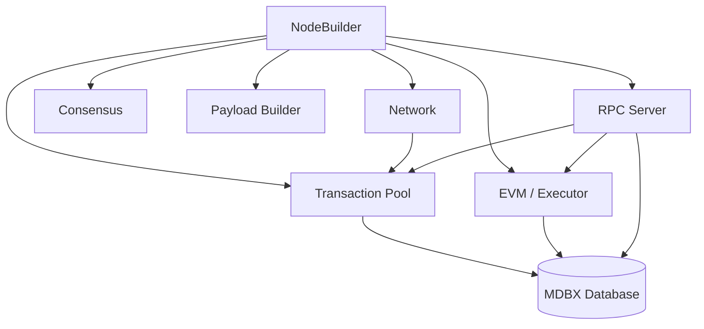

Reth is designed to be used as a library. Every component — the transaction pool, EVM, consensus engine, RPC server, and P2P network — is a standalone crate you can import, customize, and compose. The Reth SDK gives you a high-level entry point to all of these components through a single meta-crate.

## What you can build

<CardGroup cols={2}>
  <Card title="Custom Ethereum nodes" icon="server">
    Replace individual components — the payload builder, transaction validator, EVM config — while keeping the rest of the node intact.
  </Card>
  <Card title="Execution Extensions (ExEx)" icon="puzzle">
    Run indexers, bridges, and rollup derivation pipelines in-process with the node, reacting to block commits and reorgs.
  </Card>
  <Card title="High-performance indexers" icon="database">
    Access the MDBX database directly and read historical state, receipts, and transactions without going through JSON-RPC.
  </Card>
  <Card title="L2 sequencers" icon="layers">
    Build a fully custom chain with its own type system, consensus rules, and payload building logic on top of Reth's staged sync.
  </Card>
</CardGroup>

## Quick start

Add the `reth-ethereum` meta-crate to your `Cargo.toml`. It re-exports all commonly used Reth crates under a single dependency, with feature flags to control which components are compiled.

```toml
[dependencies]
reth-ethereum = { git = "https://github.com/paradigmxyz/reth", features = ["full"] }
```

<Note>
The `full` feature enables the node builder, EVM, consensus, network, RPC, transaction pool, and provider. Use individual features like `node`, `evm`, or `pool` for smaller builds.
</Note>

The simplest way to launch a node is through the CLI interface, which parses standard Reth arguments and hands off to a builder:

```rust
use reth_ethereum::{
    cli::interface::Cli,
    node::{node::EthereumAddOns, EthereumNode},
};

fn main() {
    Cli::parse_args()
        .run(async move |builder, _| {
            let handle = builder
                // Install the Ethereum node type system
                .with_types::<EthereumNode>()
                // Use default Ethereum components
                .with_components(EthereumNode::components())
                .with_add_ons(EthereumAddOns::default())
                .launch()
                .await?;

            handle.wait_for_node_exit().await
        })
        .unwrap();
}
```

To customize a component — for example, swapping the transaction pool — pass a custom builder to the relevant method:

```rust
use reth_ethereum::{
    cli::interface::Cli,
    node::{node::EthereumAddOns, EthereumNode},
};

fn main() {
    Cli::parse_args()
        .run(async move |builder, _| {
            let handle = builder
                .with_types::<EthereumNode>()
                .with_components(
                    EthereumNode::components()
                        .pool(CustomPoolBuilder::default())
                        // Other customizable slots:
                        // .network(CustomNetworkBuilder::default())
                        // .executor(CustomExecutorBuilder::default())
                        // .consensus(CustomConsensusBuilder::default())
                        // .payload(CustomPayloadBuilder::default())
                )
                .with_add_ons(EthereumAddOns::default())
                .launch()
                .await?;

            handle.wait_for_node_exit().await
        })
        .unwrap();
}
```

## Architecture

The `NodeBuilder` assembles all components and manages their lifecycle. Components declare their dependencies through trait bounds, so the compiler enforces that pool, network, EVM, consensus, and payload builder types are all compatible.



The components are built in dependency order: the EVM config is built first, then the pool (which depends on the EVM for validation), then the network (which depends on the pool for transaction broadcasting), then the payload builder.

## Feature flags

The `reth-ethereum` crate uses Cargo feature flags to keep compile times manageable:

| Feature | What it enables |
|---|---|
| `full` | All components: node, EVM, pool, network, RPC, consensus, trie |
| `node` | Node builder, EVM, consensus, network, RPC, pool, trie |
| `evm` | EVM configuration and block execution |
| `pool` | Transaction pool |
| `network` | P2P networking stack |
| `rpc` | JSON-RPC server |
| `consensus` | Block and header validation |
| `provider` | Database access layer |
| `exex` | Execution Extensions |
| `cli` | CLI argument parsing |

## Nodes built on Reth

Several production networks have used Reth's node builder to ship their execution clients:

| Node | Organization | Description | Approx. lines of custom code |
|---|---|---|---|
| [Base Node](https://github.com/base/node-reth) | Coinbase | Coinbase's L2 scaling solution | ~3K |
| [Bera Reth](https://github.com/berachain/bera-reth) | Berachain | High-performance EVM with custom features | ~1K |
| [Reth Gnosis](https://github.com/gnosischain/reth_gnosis) | Gnosis Chain | xDai-compatible execution client | ~5K |
| [Reth BSC](https://github.com/loocapro/reth-bsc) | BNB Smart Chain | BNB Smart Chain execution client | ~6K |

Each of these nodes customizes one or more components — consensus rules, payload building, EVM precompiles — while reusing everything else from Reth.

## Resources

<CardGroup cols={2}>
  <Card title="crates.io" icon="box" href="https://crates.io/crates/reth-ethereum">
    Published `reth-ethereum` crate on crates.io.
  </Card>
  <Card title="docs.rs" icon="book-open" href="https://docs.rs/reth/latest/reth/">
    Generated API documentation for all public types and traits.
  </Card>
  <Card title="GitHub" icon="github" href="https://github.com/paradigmxyz/reth">
    Source code, examples, and issue tracker.
  </Card>
  <Card title="Examples" icon="code" href="https://github.com/paradigmxyz/reth/tree/main/examples">
    Runnable examples for custom components, ExExes, and node variants.
  </Card>
</CardGroup>

## Next steps

<CardGroup cols={2}>
  <Card title="Node Components" icon="puzzle" href="/sdk/node-components">
    Understand what each swappable component does and how to replace it.
  </Card>
  <Card title="Type System" icon="shapes" href="/sdk/typesystem">
    Learn how Reth's primitives, transaction types, and block types fit together.
  </Card>
  <Card title="Execution Extensions" icon="bolt" href="/exex/overview">
    Build in-process indexers and pipelines that react to chain events.
  </Card>
</CardGroup>
