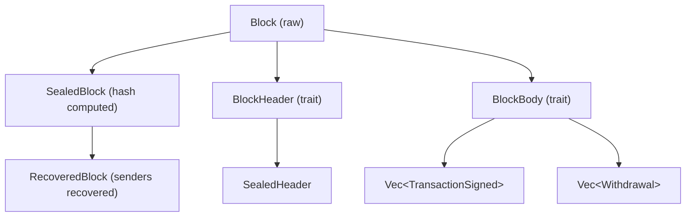
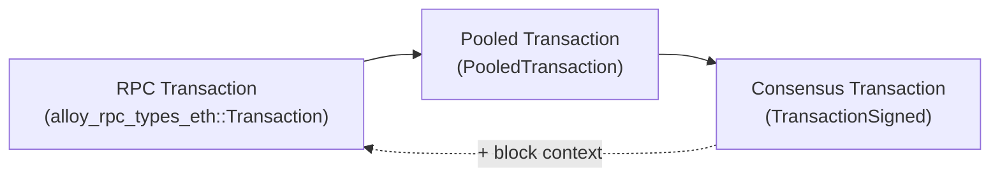

Reth's type system is built on top of [Alloy](https://github.com/alloy-rs/alloy), the shared Ethereum primitive library. Reth adds its own layered types on top of Alloy's primitives to handle the different contexts in which blockchain data appears — on the wire, in the mempool, in blocks on disk, and in RPC responses.

## Primitive types

The foundational types are re-exported from Alloy and used throughout the entire codebase:

| Type | Description | Example |
|---|---|---|
| `B256` | 32-byte hash | Block hash, transaction hash, storage key |
| `Address` | 20-byte Ethereum address | `0xd8dA6BF...` |
| `U256` | 256-bit unsigned integer | ETH balances, token amounts |
| `Bytes` | Variable-length byte buffer | Contract bytecode, calldata |
| `ChainId` | `u64` chain identifier | `1` for mainnet, `11155111` for Sepolia |

```rust
use reth_ethereum::primitives::{B256, U256};
use alloy_primitives::Address;

// All three are the same underlying Alloy types
let hash = B256::ZERO;
let addr = Address::ZERO;
let amount = U256::from(1_000_000_000u64); // 1 Gwei in wei
```

<Note>
Reth re-exports Alloy primitives through `reth_ethereum::primitives`. You don't need to add `alloy-primitives` as a separate dependency when using `reth-ethereum`.
</Note>

## Block type hierarchy

Blocks in Reth go through several representations as they move through the node. Each representation adds additional computed or verified properties.



### `Block`

The base block type is a type alias for Alloy's generic block with Reth's signed transaction type:

```rust
// From reth-ethereum-primitives
pub type Block = alloy_consensus::Block<TransactionSigned>;
pub type BlockBody = alloy_consensus::BlockBody<TransactionSigned>;
```

A `Block` contains a `Header` and a `BlockBody`. The body holds the list of signed transactions, withdrawals (post-Shanghai), and blob gas usage (post-Cancun).

### `SealedBlock`

A `SealedBlock` wraps a `Block` with its hash pre-computed and cached. This is the representation used throughout most of the node after a block has been downloaded or constructed:

```rust
use reth_ethereum::primitives::SealedBlock;

// The hash is computed once and stored — no repeated keccak256 calls
let sealed: SealedBlock<Block> = block.seal_slow();

// Access the hash without recomputing
let hash: B256 = sealed.hash();
let header = sealed.header();
```

<Tip>
Use `seal_slow()` for blocks you've assembled yourself. When you already know the hash (e.g. from a network message), use `seal(hash)` to avoid recomputation.
</Tip>

### `SealedHeader`

`SealedHeader` works the same way as `SealedBlock` but only wraps the header. It is used in block propagation and header-only sync stages:

```rust
use reth_ethereum::primitives::SealedHeader;

let sealed_header: SealedHeader = header.seal_slow();
let parent_hash: B256 = sealed_header.parent_hash;
let block_number: u64 = sealed_header.number;
```

### `RecoveredBlock`

`RecoveredBlock` extends `SealedBlock` with the recovered sender addresses for each transaction. Recovering an address requires an ECDSA signature verification, so caching this result avoids redundant work:

```rust
use reth_ethereum::primitives::RecoveredBlock;

// Recover all senders (expensive — involves ECDSA recovery for each tx)
let recovered: RecoveredBlock<Block> = sealed_block.try_recover()?;

// Now senders are available without recomputation
for (tx, sender) in recovered.transactions_with_sender() {
    println!("{sender} sent tx with hash {}", tx.hash());
}
```

## Transaction type hierarchy

Transactions have three representations in Reth, each optimized for a different stage in the transaction lifecycle.



### Consensus transaction: `TransactionSigned`

`TransactionSigned` is the canonical on-chain representation. It is what gets included in blocks, stored in the database, and propagated between nodes. It is a type alias for Alloy's `EthereumTxEnvelope`:

```rust
// From reth-ethereum-primitives
pub type TransactionSigned = alloy_consensus::EthereumTxEnvelope<TxEip4844>;
```

This enum has variants for each Ethereum transaction type:

```rust
use alloy_consensus::EthereumTxEnvelope;

match &tx {
    EthereumTxEnvelope::Legacy(tx) => { /* pre-EIP-2718 */ }
    EthereumTxEnvelope::Eip2930(tx) => { /* EIP-2930 access lists */ }
    EthereumTxEnvelope::Eip1559(tx) => { /* EIP-1559 priority fees */ }
    EthereumTxEnvelope::Eip4844(tx) => { /* EIP-4844 blob transactions */ }
    EthereumTxEnvelope::Eip7702(tx) => { /* EIP-7702 authority designation */ }
    _ => {}
}
```

### Pooled transaction: `PooledTransaction`

`PooledTransaction` is used in the transaction pool. For most transaction types it is identical to `TransactionSigned`, but for EIP-4844 blob transactions it includes the blob sidecar (the actual blob data that is not stored on-chain):

```rust
// From reth-ethereum-primitives
pub type PooledTransaction = alloy_consensus::PooledTransaction;

// For blob transactions, the sidecar is attached:
// EthereumTxEnvelope<TxEip4844WithSidecar>
```

<Note>
Blob sidecars are stripped before a transaction is included in a block. The on-chain `TransactionSigned` for an EIP-4844 transaction contains only the commitment, not the blob data itself.
</Note>

### RPC transaction

The RPC representation is the JSON format returned by `eth_getTransactionByHash` and similar methods. It is defined in the `alloy-rpc-types-eth` crate and includes all fields needed by external clients, including block context:

```rust
use reth_ethereum::rpc::eth::primitives::Transaction;

// Fields present in the RPC representation but not in TransactionSigned:
// - blockHash: Option<B256>
// - blockNumber: Option<u64>
// - transactionIndex: Option<u64>
// - from: Address  (recovered sender)
```

## `NodePrimitives` and the type system

Reth's generic node infrastructure is parameterized over a `NodePrimitives` implementation. This trait bundles all the primitive types for a specific chain together:

```rust
// From reth-ethereum-primitives
pub struct EthPrimitives;

impl reth_primitives_traits::NodePrimitives for EthPrimitives {
    type Block = Block;                          // alloy_consensus::Block<TransactionSigned>
    type BlockHeader = alloy_consensus::Header;
    type BlockBody = BlockBody;
    type SignedTx = TransactionSigned;
    type Receipt = Receipt;
}
```

When you call `.with_types::<EthereumNode>()` on the node builder, you are installing `EthPrimitives` as the concrete `NodePrimitives` implementation. All components — pool, network, EVM, consensus — then use this type to stay consistent.

For a custom chain, you would define your own `NodePrimitives` implementation with your own block and transaction types.

## Common patterns

### Checking transaction type

```rust
use alloy_consensus::EthereumTxEnvelope;

fn is_blob_transaction(tx: &TransactionSigned) -> bool {
    matches!(tx, EthereumTxEnvelope::Eip4844(_))
}
```

### Getting the sender of a signed transaction

```rust
use reth_ethereum::primitives::SignedTransaction;

// Recover the sender by verifying the ECDSA signature
let sender: Address = tx.recover_signer()?;
```

### Hashing a block header

```rust
use reth_ethereum::primitives::SealedHeader;

// seal_slow() computes the keccak256 of the RLP-encoded header
let sealed = header.seal_slow();
let block_hash: B256 = sealed.hash();
```

### Building a sealed block from parts

```rust
use reth_ethereum::primitives::{Block, SealedBlock};
use alloy_consensus::{BlockBody, Header};

let header = Header { number: 1, ..Default::default() };
let body = BlockBody { transactions: vec![], ..Default::default() };
let block = Block { header, body };

// Compute and cache the block hash
let sealed: SealedBlock<Block> = block.seal_slow();
```

## How Alloy integrates with Reth

Reth does not define its own low-level Ethereum types. Instead, it uses Alloy crates directly and adds adapter types where needed:

| Layer | Provided by |
|---|---|
| Primitive types (`B256`, `Address`, `U256`) | `alloy-primitives` |
| Consensus types (`Header`, `TxEip1559`, `Block`) | `alloy-consensus` |
| RPC types (`Transaction`, `Block` as returned by JSON-RPC) | `alloy-rpc-types-eth` |
| EVM execution (`revm`) | `revm` via `reth-revm` |
| Storage encoding | `reth-codecs` (Compact encoding for MDBX) |

The `reth-ethereum-primitives` crate provides the glue: it defines the `EthPrimitives` struct, declares the concrete type aliases (`TransactionSigned`, `Block`, `BlockBody`), and implements the `NodePrimitives` trait so that all of Reth's generic infrastructure can use these types.

## Next steps

<CardGroup cols={2}>
  <Card title="Node Components" icon="puzzle" href="/sdk/node-components">
    See how these types flow through the pool, EVM, and network components.
  </Card>
  <Card title="EVM" icon="cpu" href="/sdk/node-components/evm">
    How `RecoveredBlock` and `TransactionSigned` are used during block execution.
  </Card>
  <Card title="Transaction Pool" icon="list-ordered" href="/sdk/node-components/pool">
    How `PooledTransaction` is validated and managed in the mempool.
  </Card>
  <Card title="Execution Extensions" icon="bolt" href="/exex/overview">
    Working with blocks and receipts in ExEx notifications.
  </Card>
</CardGroup>
